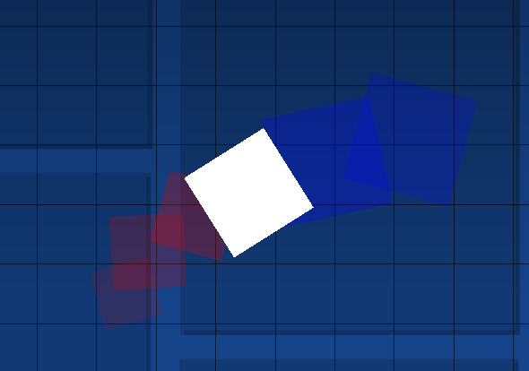

# Onion Skin
Adds an onion skin to the Geometry Dash editor.

## How to use
Onion skin can be enabled in the editor using the following button found next to the layer controls:

Because `F9` is a vanilla keybind now, the `Shift` Modifier is added by default. The Base Keybinds can be changed however.

This mod adds 2 new editor keybinds:
- `Shift + F9` - toggle past frames
- `Shift + F10` - toggle future frames

## Previews:

